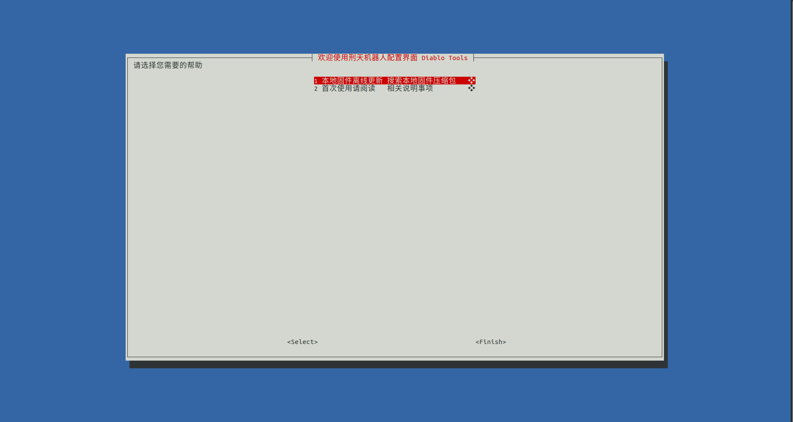
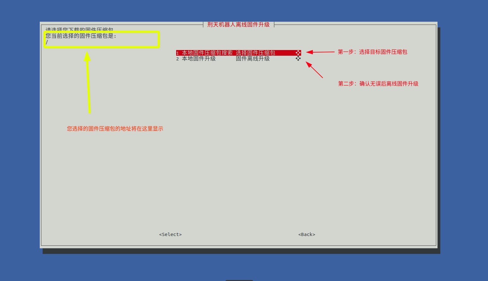

# 						Diablo Tools使用指南

###### 																					 本末科技 

准备工作：需要Diablo Tools工具、固件压缩包(zip)

第一步：在上位机（地平线或者树莓派）中进入Diablo Tools文件夹，输入下面的命令为脚本赋予可执行权限

```bash
chmod +x Start_DiabloTools_CN.sh
```

随后输入输入以下命令执行：

```bash
./Start_DiabloTools_CN.sh
```

然后您将看到这个界面



选择第一个选项，执行本地离线固件升级

您将进入到离线升级界面，这里您将选择目标固件压缩包，并执行升级



继续选择第一个选项，选择您获取到的固件压缩包的地址，我们的固件压缩包是zip类型的，您也只能选择zip类型的文件。

选择完毕后，您将在离线升级界面看到您选择的目标文件的地址（如上图黄色框线处）。

随后选择第二步执行本地固件升级，在升级前请您务必确认固件压缩包是否选择正确。


如果升级失败，您可以重启机器人并再次尝试升级。